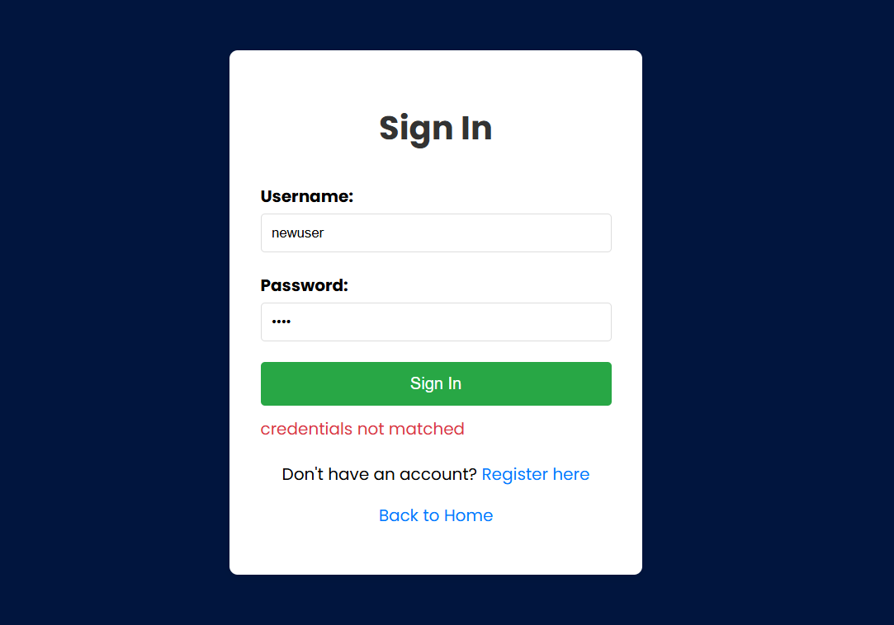
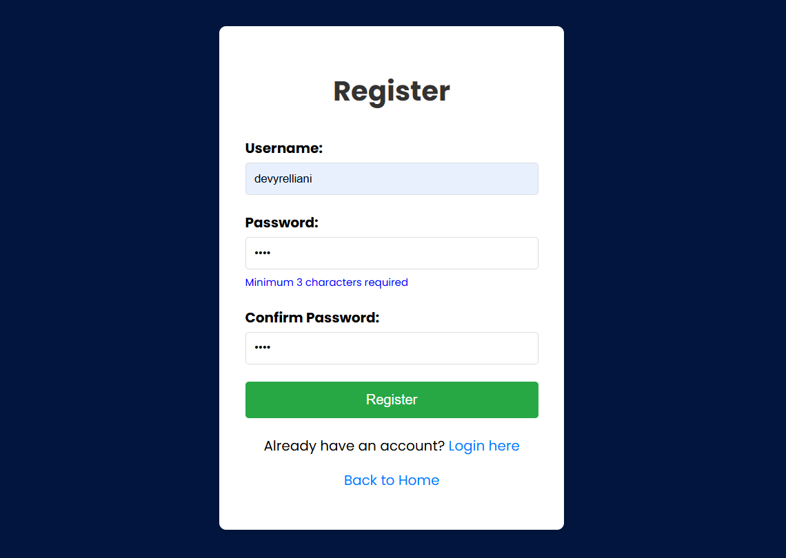
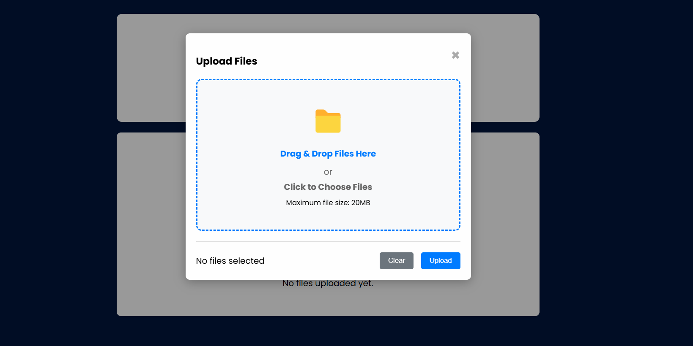
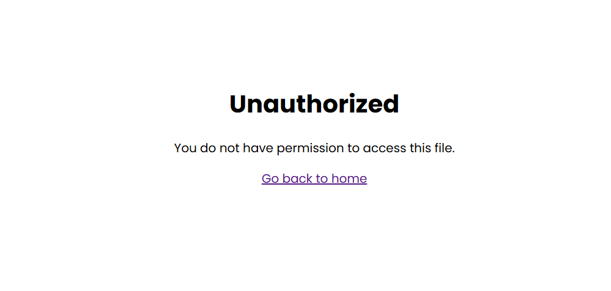

# 🚀 Cloud File Manager


Our project consists of developing a simple file manager web application  where you can create an account, upload your files, rename, delete, and even share them with the public if you want! Don't worry; when you set a file to private, only you can see it.

These are the short documentation what's inside of our project if you want to check out more detailed (with Bahasa Indonesia), kindly check this link!

<a href="https://docs.google.com/document/d/1hWJadSU2UKUFZ6RRr00kNXwfNsWmDqDb6QAkWa2UOQY/edit?tab=t.0"> > Detailed Documention in Bahasa. </a>

## 🌟 Features
### Core Functionality
- **File Upload & Management** - Upload files up to 20MB with drag-and-drop interface
- **File Operations** - Rename, delete, and download files with ease

   - **Private by Default** - All files are private unless explicitly made public
- **Privacy Controls** - Toggle files between private and public sharing
- **File Sharing** - Generate shareable links for public files
- **File Search & Pagination** - Easy navigation through your files
### Page Overview






## 🏗️ Technology Stack

### Backend
- **Go** (Golang) - Programming languange
- **Gin** - Web development framework
- **PostgreSQL** - Primary database for user and file metadata
- **Docker** - Containerized application deployment
   - **Docker Compose** - Multi-container orchestration

### Frontend
- **HTML/CSS/JavaScript** 

### Terraform Infrastructure
- Infrastructure as Code for Azure resources
- How to use the terraform definition:
      1. Copy the *config.tfvars.json.example* file as *config.tfvars.json* 
      2. After copying the file, you can define the resource group, username and password as you like in the json.
      3. You can run the terraform on CLI by:
   ```
   terraform plan -var-file="config.tfvars.json"
   ```
   then
   ```
   terraform apply -var-file="config.tfvars.json"
   ```

   #### For destroying the terraform:
   ```
   terraform destroy -var-file="config.tfvars.json"
   ```
   **Note:** All resources will be provisioned on Azure Cloud. 
### CI/CD
- **Github Actions** - Integrated with Github

### Development & Testing
- **Go Modules** - Dependency management
- **Unit Testing** - Comprehensive test coverage with testify

## 🚀 Getting Started

### Prerequisites
- Go 1.24.4 
- Docker and Docker Compose
- PostgreSQL 

### Local Development

1. **Clone the repository**
   ```bash
   git clone <repository-url>
   cd FP-DevOps
   ```

2. **Set up environment variables**
   ```bash
   cd app
   cp .env.example .env
   # Edit .env with your database and JWT configuration
   ```

3. **Run the application**
   ```bash
   #using docker compose
   docker-compose up -d
   ```
   or

   ```bash
   #using go
   go run main.go
   ```
   lastly
   ```
   ./main.exe
   ```

4. **Access the application**
   - Web Interface: http://localhost:8888
   - API Endpoints: http://localhost:8888/api
      - or your designated localhost 

## 📊 API Documentation

### Authentication Endpoints
- `POST /api/user/register` - Create new user account
- `POST /api/user/login` - User authentication
- `GET /api/user/me` - Get current user information

### File Management Endpoints
- `GET /api/file` - List user's files (paginated)
- `POST /api/file` - Upload new file
- `GET /api/file/:id` - Download/view file
- `PATCH /api/file/:id` - Update file (rename/sharing)
- `DELETE /api/file/:id` - Delete file

### Web Interface Routes
- `/` - Landing page
- `/login` - User login page
- `/register` - User registration page
- `/dashboard` - Main file management interface

More details about API are available in the [Wiki Page](https://github.com/HyggeHalcyon/FP-DevOps/wiki/API-Docs)

## 🏭 DevOps Pipeline Visualization
### 🔄 Our  Architecture
.png>)
### 🔄 Our CI/CD Pipeline
.png>)

### 🧪 Stage 1: Continuous Integration (CI)

#### **Test Pipeline** (`test.yml`)
**When it runs:** Every push to any branch + every pull request.

**What it does:**
```yaml
Workflow Steps:
1. Checkout code from repository
2. Set up Go environment (version 1.20)
3. Start PostgreSQL service for testing
4. Checkout Repository
5. Install Go dependencies
6. Execute unit test suite
```

**How to run test:**
```
PS D:\git\FP-DevOps\app> go test -v -cover ./...
```

### 🏗️ Stage 2: Build and Containerization

#### **Build Pipeline** (`build.yml`)
**When it runs:** After successful tests on `development` and `main` branches.

**Detailed Build Process:**
```yaml
Build Steps:
1. Compile Go application
2. Create Docker image
3. Push to artifact
```

**How to run build process:**
```
PS D:\git\FP-DevOps\app> docker compose up -d --build
```
or
```
PS D:\git\FP-DevOps\app> go build main.go
```

### 🚀 Stage 3: Continuous Deployment (CD)

#### **Deployment Pipeline** (`deploy.yml`)
**When it runs:** After successful build, triggered by branch-specific rules

**Branches Environment:**
```
Branch Strategy:
├── *feature* branches → No automatic deployment
├── development branch → Auto-deploy to Development VM
├── main branch → Auto-deploy to Production VM (after manual pull request approval)
```

**Deployment Process:**
```yaml
Deployment Steps:
1. SSH Connection Setup
   └── Establish secure connection to Azure VM

2. Application Update
   ├── Checkout repository according to branch* (Dev/Prod)
   ├── Destroy previous deployment
   └── Update environment variables
```

## 🔧 Configuration

### Environment Variables
| Variable | Description | 
|----------|-------------|
| `ENV` | Environment (development/production) | 
| `PORT` | Application port |
| `DB_HOST` | PostgreSQL host |
| `DB_USER` | Database username |
| `DB_PASS` | Database password |
| `DB_NAME` | Database name |
| `DB_PORT` | Database port |
| `JWT_SECRET` | JWT signing secret |

### Example Environment Setup
```bash
DB_HOST=localhost
DB_PORT=5432
DB_USER=postgres
DB_PASS=postgres
DB_NAME=test_db
ENV=development
```

## 📁 Project Structure

```
FP-DevOps/
├── .github/                # CI/CD Workflows
│   └── workflows/         
│       ├── test.yml       # Automated testing pipeline
│       ├── build.yml      # Build and containerization
│       └── deploy.yml     # Deployment automation
├── app/                   # Main application
│   ├── config/           # Database and JWT configuration
│   ├── controller/       # HTTP request handlers
│   ├── dto/             # Data transfer objects
│   ├── entity/          # Database models
│   ├── middleware/      # Authentication and CORS
│   ├── repository/      # Database operations
│   ├── service/         # Business logic
│   ├── routes/          # API route definitions
│   ├── templates/       # HTML templates
│   ├── tests/           # Unit tests
│   ├── storage/         # File storage directory
│   ├── docker/          # Docker configuration
│   │   ├── nginx/       # Nginx proxy configuration
│   │   └── air/         
│   ├── docker-compose.yml # Multi-container
│   └── Dockerfile       # Application container definition
├── terraform/           # Infrastructure as Code
│   ├── providers.tf     # Terraform providers configuration
│   ├── variables.tf     # Input variables
│   ├── vm.tf           # Virtual machine configuration
│   ├── network.tf      # Network infrastructure
│   ├── storage.tf      # Storage accounts
│   ├── outputs.tf      # Output values
│   └── config.tfvars.json.example # Input template
└── README.md            # Project documentation
```

## 🌐 Live Demo
Visit our live application (Development): http://13.78.95.97
Visit our live application (Production): http://52.185.154.52
