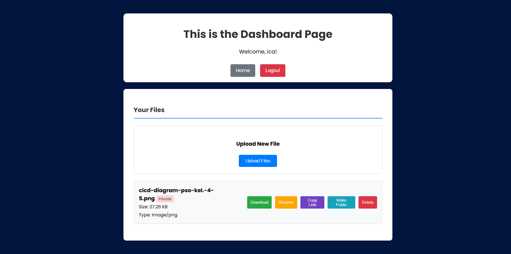

# 🚀 Cloud File Manager



Our project consists of developing a web application for a cloud file manager where you can create an account, upload your files to our cloud that is integrated with Azure, rename, delete, and even share them with the public if you want! Don't worry; when you set a file to private, only you can see it.

These are the short documentation what's inside of our project if you want to check out more detailed (with Bahasa Indonesia), kindly check this link!

<a href="https://docs.google.com/document/d/1hWJadSU2UKUFZ6RRr00kNXwfNsWmDqDb6QAkWa2UOQY/edit?tab=t.0"> > Detailed Documention in Bahasa. </a>

## 🌟 Features
### Core Functionality
- **File Upload & Management** - Upload files up to 20MB with drag-and-drop interface
- **File Operations** - Rename, delete, and download files with ease

   - **Private by Default** - All files are private unless explicitly made public
- **Privacy Controls** - Toggle files between private and public sharing
- **File Sharing** - Generate shareable links for public files
- **File Search & Pagination** - Easy navigation through your files

## 🏗️ Technology Stack

### Backend
- **Go** (Golang) - Applicable for a simple web application
- **Gin** - Backend framework from Go
- **PostgreSQL** - Primary database for user and file metadata

### Frontend
- **HTML/CSS/JavaScript** 

### Infrastructure 
- **Docker** - Containerized application deployment
   - **Docker Compose** - Multi-container orchestration
- **Terraform** - Infrastructure as Code for Azure resources
- **Azure Cloud** - Production hosting platform

### Development & Testing
- **Go Modules** - Dependency management
- **Unit Testing** - Comprehensive test coverage with testify

## 🚀 Getting Started

### Prerequisites
- Go 1.20 or higher
- Docker and Docker Compose
- PostgreSQL 

### Local Development

1. **Clone the repository**
   ```bash
   git clone <repository-url>
   cd FP-DevOps
   ```

2. **Set up environment variables**
   ```bash
   cd app
   cp .env.example .env
   # Edit .env with your database and JWT configuration
   ```

3. **Run with Docker Compose**
   ```bash
   docker-compose up -d
   ```

4. **Execute your web application**
   ```bash
   go run main.go
   ```
   lastly
   ```
   ./main.exe
   ```

4. **Access the application**
   - Web Interface: http://localhost:8888
   - API Endpoints: http://localhost:8888/api
      - or your designated localhost 

## 📊 API Documentation

### Authentication Endpoints
- `POST /api/user/register` - Create new user account
- `POST /api/user/login` - User authentication
- `GET /api/user/me` - Get current user information

### File Management Endpoints
- `GET /api/file` - List user's files (paginated)
- `POST /api/file` - Upload new file
- `GET /api/file/:id` - Download/view file
- `PATCH /api/file/:id` - Update file (rename/sharing)
- `DELETE /api/file/:id` - Delete file

### Web Interface Routes
- `/` - Landing page
- `/login` - User login page
- `/register` - User registration page
- `/dashboard` - Main file management interface

## 🏭 DevOps & CI/CD Pipeline
### 🔄 Our CI/CD Architecture
.png>)

.png>)

### 🧪 Stage 1: Continuous Integration (CI)

#### **Test Pipeline** (`test.yml`)
**When it runs:** Every push to any branch + every pull request.

**What it does:**
```yaml
Workflow Steps:
1. Checkout code from repository
2. Set up Go environment (version 1.20)
3. Start PostgreSQL service for testing
4. Checkout Repository
5. Install Go dependencies
6. Run database migrations
7. Execute unit test suite
8. Generate test coverage report
9. Upload coverage to code coverage service
```

**How to run test:**
```
PS D:\git\FP-DevOps\app> go test ./...
```

### 🏗️ Stage 2: Build and Containerization

#### **Build Pipeline** (`build.yml`)
**When it runs:** After successful tests on `development` and `main` branches.

**Detailed Build Process:**
```yaml
Build Steps:
1. Compile Go application
2. Create Docker image
3. Push to registry
```

**How to run build process:**
```
PS D:\git\FP-DevOps\app> docker compose up -d --build
```
or
```
PS D:\git\FP-DevOps\app> go build main.go
```

### 🚀 Stage 3: Continuous Deployment (CD)

#### **Deployment Pipeline** (`deploy.yml`)
**When it runs:** After successful build, triggered by branch-specific rules

**Branches Environment:**
```
Branch Strategy:
├── feature/* branches → No automatic deployment
├── development branch → Auto-deploy to Development VM
├── main branch → Auto-deploy to Production VM (after manual approval)
└── hotfix/* branches → Auto-deploy to both (emergency fixes)
```

**Deployment Process Deep Dive:**
```yaml
Deployment Steps:
1. SSH Connection Setup
   ├── Establish secure connection to PSOVM-Dev
   ├── Verify VM health and resources
   └── Backup current deployment

2. Application Update
   ├── Pull latest Docker images
   ├── Update environment variables
   ├── Run database migrations (if any)
   └── Update docker-compose.yml

3. Zero-Downtime Deployment
   ├── Start new containers alongside old ones
   ├── Health check new containers
   ├── Switch traffic to new containers
   └── Remove old containers

4. Post-Deployment Verification
   ├── API health checks
   ├── Database connectivity tests
   ├── File upload functionality tests
   └── User authentication tests
```

#### Test Environment Setup
```bash
# Test database configuration (automated in CI)
DB_HOST=localhost
DB_PORT=5432
DB_USER=postgres
DB_PASS=postgres
DB_NAME=test_db
ENV=development
```

## 📁 Project Structure

```
FP-DevOps/
├── .github/                # CI/CD Workflows
│   └── workflows/         
│       ├── test.yml       # Automated testing pipeline
│       ├── build.yml      # Build and containerization
│       └── deploy.yml     # Deployment automation
├── app/                   # Main application
│   ├── config/           # Database and JWT configuration
│   ├── controller/       # HTTP request handlers
│   ├── dto/             # Data transfer objects
│   ├── entity/          # Database models
│   ├── middleware/      # Authentication and CORS
│   ├── repository/      # Database operations
│   ├── service/         # Business logic
│   ├── routes/          # API route definitions
│   ├── templates/       # HTML templates
│   ├── tests/           # Unit tests
│   ├── storage/         # File storage directory
│   ├── docker/          # Docker configuration
│   │   ├── nginx/       # Nginx proxy configuration
│   │   └── air/         # Hot reload configuration
│   ├── docker-compose.yml # Multi-container orchestration
│   └── Dockerfile       # Application container definition
├── terraform/           # Infrastructure as Code
│   ├── providers.tf     # Terraform providers configuration
│   ├── variables.tf     # Input variables
│   ├── vm.tf           # Virtual machine configuration
│   ├── network.tf      # Network infrastructure
│   ├── storage.tf      # Storage accounts
│   ├── outputs.tf      # Output values
│   └── config.tfvars.json.example # Configuration template
└── README.md            # Project documentation
```

## 🔧 Configuration

### Environment Variables
| Variable | Description | 
|----------|-------------|
| `ENV` | Environment (development/production) | 
| `PORT` | Application port |
| `DB_HOST` | PostgreSQL host |
| `DB_USER` | Database username |
| `DB_PASS` | Database password |
| `DB_NAME` | Database name |
| `DB_PORT` | Database port |
| `JWT_SECRET` | JWT signing secret |

## 🌐 Live Demo
Visit our live application: http://52.185.154.52
